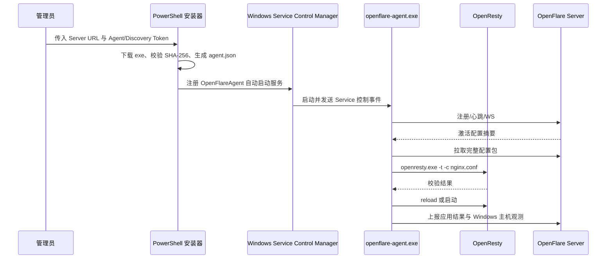

# Windows Server Agent 设计

## 目标与边界

Windows Server 受控端复用现有 Agent HTTP/WebSocket 协议与配置发布模型，以原生 `openflare-agent.exe` 运行。V1 不引入 Docker，也不允许控制面向节点发送任意命令；Agent 只执行二进制内置的配置同步、OpenResty 校验/重载、观测上报和自更新动作。

Windows Agent 的数据面依赖节点上已安装的 Windows 版 OpenResty。安装器负责检查 `openresty.exe` 并将路径写入 `agent.json`，不替代 OpenResty 的发行和安装。

## 运行模型

Agent 在交互式控制台运行时继续使用 Ctrl+C 退出；由 SCM 启动时通过 `golang.org/x/sys/windows/svc` 报告启动、运行和停止状态，并将服务停止事件转换为 Agent 根 context 取消。

## 文件与权限

默认安装目录为 `%ProgramFiles%\OpenFlare\Agent`，运行数据位于 `data` 子目录，配置文件为 `agent.json`。安装器只授予 `SYSTEM` 和本机 `Administrators` 组访问配置文件的权限，Token 不通过命令行长期保存。

Windows 没有 Unix UID/GID，Agent 不执行 Linux 运行用户降权和 `chown`；Windows 服务默认使用 `LocalSystem`，OpenResty 由 Agent 以同一服务上下文启动。Agent 仍使用临时文件和原子替换写入配置，避免在进程重启或网络中断时破坏本地快照。

## 主机观测

Windows 使用系统 API 采集内存、磁盘空间、CPU 时间和系统运行时长；无法获取的 CPU 型号等字段保持为空。观测协议不变，Agent 继续只上报事实读数和访问日志明细，不在节点侧生成 UV、TopN 或业务汇总。

## 升级与恢复

控制面发布的 Windows 资产命名为 `openflare-agent-windows-amd64.exe` 或 `openflare-agent-windows-arm64.exe`，同时提供对应 `.sha256` 文件。Agent 自更新使用现有 Windows 原子替换脚本，在旧进程退出后替换 exe 并重新启动，失败时保留 `.bak` 回退文件。

安装器重复执行时先停止并重建同名 Windows 服务，再覆盖二进制和配置；配置应用失败仍沿用现有本地备份、Safe Fallback 和版本阻断机制。

## 不在 V1 范围

* 自动下载或安装 OpenResty Windows 发行包。
* 用 Windows 注册表替代 `agent.json`。
* 远程 PowerShell、CMD 或任意命令执行。
* Windows 专用的系统日志查询或性能计数器全量采集。
